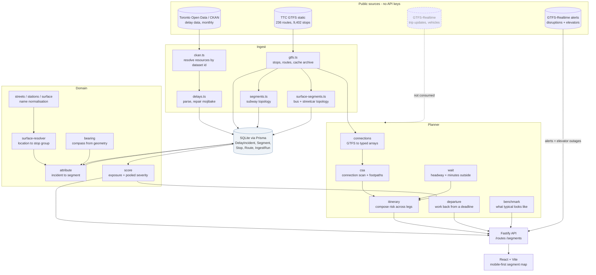
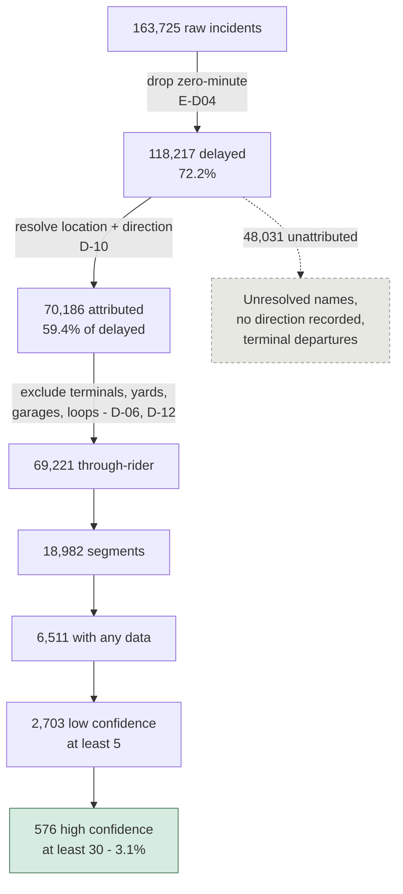
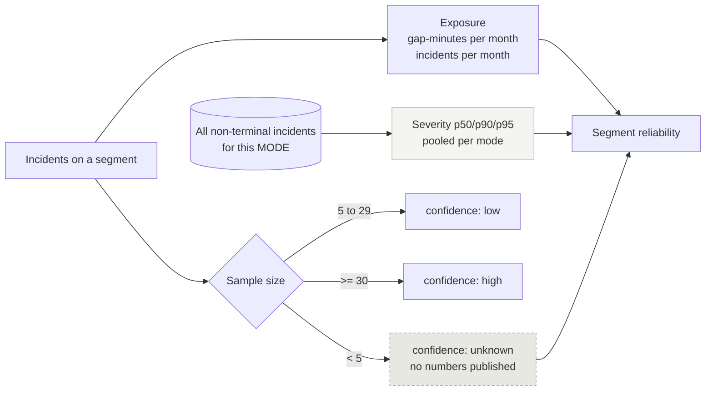

# System Architecture

What actually runs, as of **2026-08-29 — M12 plus the benchmark, route ranking, vanishing
service and D-34.** Planned components are marked; nothing here is aspirational unless
labelled. Diagrams are parsed by `npm run check:diagrams`, because GitHub renders a broken
one as nothing at all.

---

## Data flow

**Half the realtime story is wired and half is not.** The alerts feed is consumed — route
disruptions qualify today's answer (`D-29`) and elevator outages block step-free routing
(`D-30`). **Trip updates and vehicle positions are not fetched at all**, which is exactly
why J-02's countdown and J-03 are unbuilt. The dashed edge is a promise, not a component.

Alerts carry no `active_period`, so presence in the latest snapshot is the only evidence one
is live. The app reports the snapshot's age and stops claiming to know past twelve hours —
silence would read as "nothing is wrong today".

## The filtering funnel

Every exclusion below is a recorded decision, not a convenience. This is the diagram that
explains why 163,725 records become 576 confidently-scored segments.

The funnel is the product's honesty problem in one picture. **Only 3.1% of segments reach
high confidence**, which is why `P-03` governs the interface and why Q-A is the highest
open question.

## Scoring model

**Exposure is segment-specific; severity is not.** Exposure persists across time periods
(rho 0.68), severity does not (rho 0.10 with only 3% ties). Publishing a per-segment p95
would be noise formatted as precision — `D-11`, the decision the measurements forced.

Severity pools **per mode**, never across: subway 9/17/23 minutes, surface 24/59/73.

## Audits as gates

Six reproducible checks. Each can fail; together they are how claims stay falsifiable
(`P-08`).

| Command | Asks | Threshold | Result |
|---|---|---|---|
| `audit:gap` | Is `Min Gap` trustworthy? | 95% coherence + completeness | **pass** — 95.2–99.6% |
| `audit:stability` | Does segment reliability persist? | rho > 0.5 | **pass on exposure** 0.68; severity 0.10 |
| `audit:coverage` | Can we place surface delay on a map? | beat 66.1% | **pass** — 76.6% |
| `audit:timeofday` | Does pooling across the day misrepresent risk? | dispersion > 25%, rho > 0.3 | **pass** — 31.2%, rho 0.406 |
| `audit:headway` | Is "runs every N min" discriminating? | fires on 5–50% of departures | **pass** — 25.0% |
| `npm test` | 171 unit tests | all pass | **pass** |

Thresholds are pre-registered **in the source**, so a verdict cannot be renegotiated after
seeing the numbers. Two of these audits reversed the design they were written to confirm:
`audit:stability` killed per-segment percentiles (`D-11`), and `audit:headway` moved the
justification for `D-34` from risk to frequency.

`npm run check:diagrams` is a seventh check of a different kind — it parses every mermaid
block in `docs/`, because GitHub fails one silently.

## What is not built

| | Needed for | Status |
|---|---|---|
| GTFS-RT trip updates + vehicle positions | J-02 countdown, J-03 | **not fetched at all** |
| Walk comparison | J-05, U-05 | nothing technical blocking it — see F-03 |
| Weather signal | `PR-13` | not started |
| Shelter data at stops | `PR-13`, D-34's "outside" figure | not ingested; the app says *outside* and claims nothing about cover |
| Rider validation | `D-08` — everything | **the binding constraint.** See `08-research.md` |

`D-07`, the accessibility commitment that outran the build when this file was first written,
is closed: elevator outages are ingested from the alerts feed and `D-30` routes around
stations that are not step-free.

**Nothing on this list is blocked on more analysis of the data we hold.** Two items need a
feed we do not fetch, one needs a dataset we have not ingested, and the largest needs a
Toronto rider.

## Deployment note

Everything runs from public data with no keys. SQLite is a development choice; Prisma makes
the move to Postgres mechanical when segment aggregation outgrows it (`D-09`).
