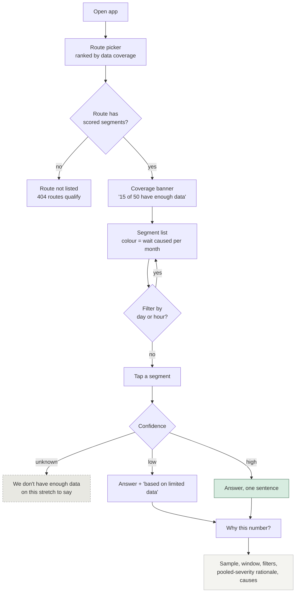
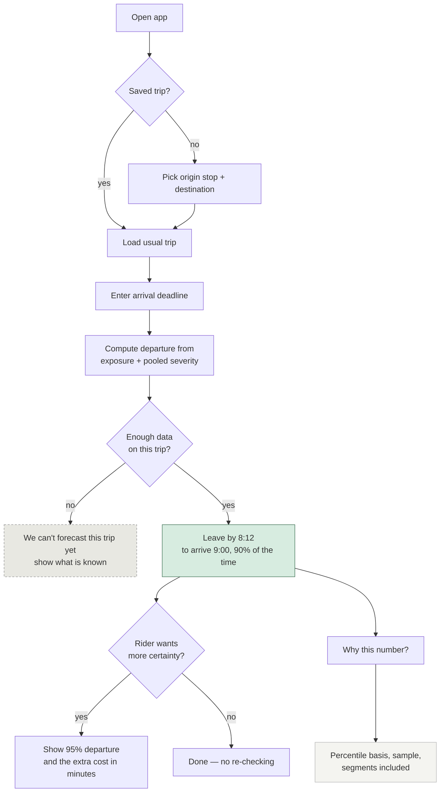
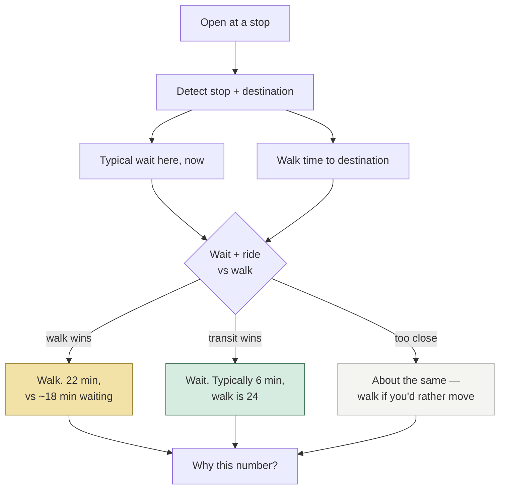
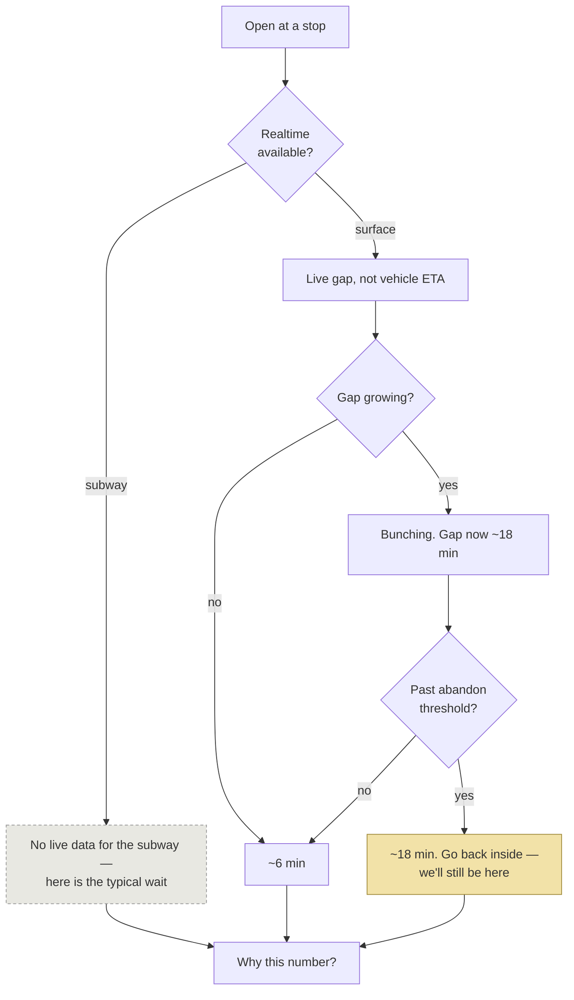

# User Flows

Screen-level flows for each journey. **Built** flows describe what runs today; **proposed**
flows are design intent and will change once D-08 closes.

*Refreshed 2026-08-29.* F-02 is now built, and the built version diverges from what was
proposed here on 2026-08-28 in one significant way — recorded below rather than tidied away.
Every diagram in this file parses: `npm run check:diagrams`.

Every flow marks its `P-09` boundary — where the machinery hides — and the points where
uncertainty must surface regardless.

---

## F-01 — Exploratory *(J-04 · U-02, U-04, U-05)* — **BUILT**

Entry is a route, not a trip, because this journey answers "is this route always like this?"
rather than "how do I get there?"

*Extended since:* the route picker now opens on a **ranking** — the routes costing riders the
most waiting per month, with the dominant cause named (`D-31`). A rider who does not already
have a route in mind is given the ones that matter rather than an alphabetical list.

**P-09 boundary:** everything from `M` onward is deferred. Nodes `J` and `K` are *not*
deferrable — they are the claim, not the method.

**Known weakness:** for a bus route, most segments land on `J`. That is Q-A.

---

## F-02 — Pre-trip forecast *(J-01 · U-02)* — **BUILT (M7–M12, D-34)**

The forecast flow `D-13` puts at the centre of the product. Note there is **no route
choice** — a captive rider has one route; asking them to pick is asking a question they
cannot answer differently.

> **The built flow diverges from the proposal below, and the divergence is the point.**
> This diagram promised *"Leave by 8:12 to arrive 9:00, 90% of the time"*, with a 95%
> variant one tap deeper. `D-24` killed that while building it: sizing a buffer to a
> percentile told riders to leave 58 minutes early for a twice-a-year event, and expected
> value fails the other way. The shipped flow **states the rate and the price and stops** —
> it does not recommend a buffer, because the rider knows the penalty for being late and we
> do not. The proposal is kept here because the reasoning error is worth being able to see
> (rule 4).
>
> The shipped flow also gained three things this diagram never had: the trip's conditions as
> tags that open (`D-33`), a comparison against typical trips of the same length (`D-28`),
> and what one missed vehicle costs (`D-34`).

**Design commitments that survived:** a departure *time*, never a duration. Confidence
stated on the face (`P-01`). The cost of buffering shown rather than assumed, because U-02's
current strategy is an hour a week of unpaid insurance and they deserve to see what they are
buying.

**The commitment that did not:** that we would name the buffer. See the note above and
`D-24`.

**Open:** Q-F — whether stating two outcomes reads as honest or as hedging. And now Q-G —
whether "runs every 27 min" reads as a cost or as a promise (`D-34`).

---

## F-03 — Downtown comparison *(J-05 · U-05)* — **PROPOSED**

> **Now the cheapest unbuilt thing in the product.** `D-34` computes the headway a rider
> faces at any stop, and a walking time is geometry. This flow is unbuilt because U-05 is
> not the primary persona — not because it is hard.

The only flow where "which option" is a real question (E-D14). It must resolve faster than
looking up the street, or it has failed.

**Design commitment:** the app must be willing to say **walk**. A transit app that never
recommends against transit is not trusted on the occasions it matters.

**Scope:** downtown only. Citywide comparison would import the New York redundancy
assumption (`D-13`).

---

## F-04 — At the stop *(J-02 · U-02)* — **PROPOSED, blocked on realtime**

The most acute journey and the least built. In January this is a safety decision, not a
convenience one (`PR-13`).

**Design commitment:** show the **gap**, never a vehicle countdown. The countdown that
resets upward is the ghost bus, and mirroring it makes us the thing riders already
distrust.

**Never deferred:** that we cannot see subway vehicles at all (E-D06).

---

## What every flow shares

1. **One answer per screen.** Everything that produced it waits behind *why this number*.
2. **Unknown is a destination, not an error.** Four of these flows have an explicit
   not-enough-data branch, styled differently from every success state.
3. **No flow asks the rider to choose a route** except F-03, which is downtown-only. That
   is `D-13` expressed as interaction rather than as prose.

## Status

| Flow | Journey | State | Blocked on |
|---|---|---|---|
| F-01 exploratory | J-04 | **built** | — |
| F-02 pre-trip forecast | J-01 | **built**, diverged from proposal | — |
| F-03 downtown comparison | J-05 | proposed | nothing technical; persona priority |
| F-04 at the stop | J-02 | proposed | GTFS-RT trip updates + vehicle positions |

Two flows are built and neither remaining one is blocked on analysis. F-04 needs a feed the
project does not fetch; F-03 needs a decision about whether U-05 is worth serving before
D-08 closes.
