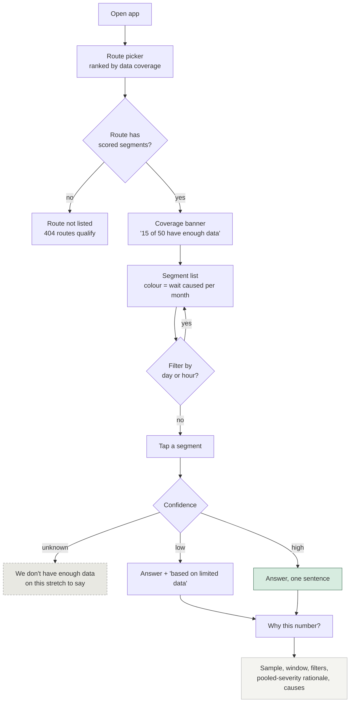
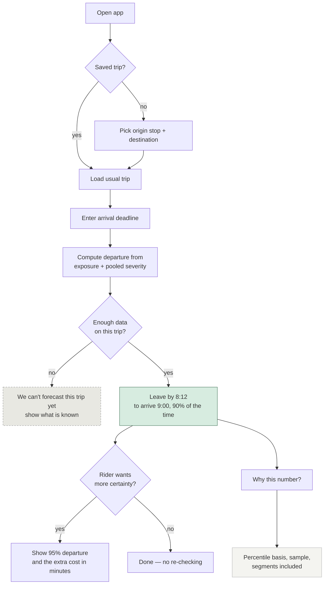
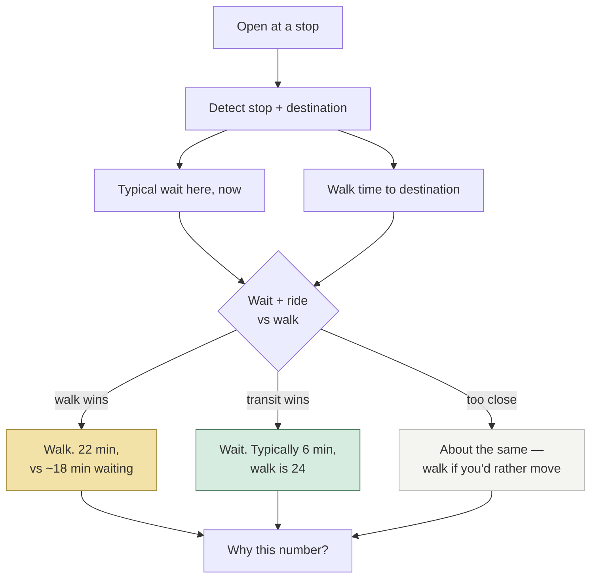
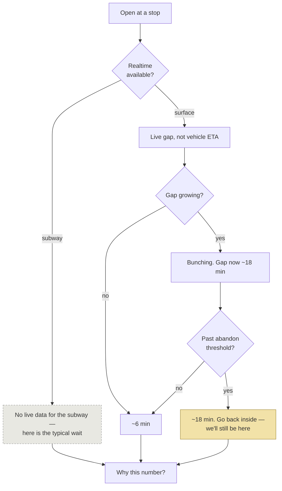

# User Flows

Screen-level flows for each journey. **Built** flows describe what runs today; **proposed**
flows are design intent and will change once D-08 closes.

Every flow marks its `P-09` boundary — where the machinery hides — and the points where
uncertainty must surface regardless.

---

## F-01 — Exploratory *(J-04 · U-02, U-04, U-05)* — **BUILT**

The only flow shipped. Entry is a route, not a trip, because this journey answers "is this
route always like this?" rather than "how do I get there?"

**P-09 boundary:** everything from `M` onward is deferred. Nodes `J` and `K` are *not*
deferrable — they are the claim, not the method.

**Known weakness:** for a bus route, most segments land on `J`. That is Q-A.

---

## F-02 — Pre-trip forecast *(J-01 · U-02)* — **PROPOSED (M7)**

The forecast flow `D-13` puts at the centre of the product. Note there is **no route
choice** — a captive rider has one route; asking them to pick is asking a question they
cannot answer differently.

**Design commitments:** a departure *time*, never a duration. Confidence is stated on the
face (`P-01`). The buffer's cost is shown, because U-02's current strategy is an hour a
week of unpaid insurance and they deserve to see what they are buying.

**Open:** Q-C — whether "90% of the time" reads as reassurance or as hedging.

---

## F-03 — Downtown comparison *(J-05 · U-05)* — **PROPOSED**

The only flow where "which option" is a real question (E-D14). It must resolve faster than
looking up the street, or it has failed.

**Design commitment:** the app must be willing to say **walk**. A transit app that never
recommends against transit is not trusted on the occasions it matters.

**Scope:** downtown only. Citywide comparison would import the New York redundancy
assumption (`D-13`).

---

## F-04 — At the stop *(J-02 · U-02)* — **PROPOSED, blocked on realtime**

The most acute journey and the least built. In January this is a safety decision, not a
convenience one (`PR-13`).

**Design commitment:** show the **gap**, never a vehicle countdown. The countdown that
resets upward is the ghost bus, and mirroring it makes us the thing riders already
distrust.

**Never deferred:** that we cannot see subway vehicles at all (E-D06).

---

## What every flow shares

1. **One answer per screen.** Everything that produced it waits behind *why this number*.
2. **Unknown is a destination, not an error.** Four of these flows have an explicit
   not-enough-data branch, styled differently from every success state.
3. **No flow asks the rider to choose a route** except F-03, which is downtown-only. That
   is `D-13` expressed as interaction rather than as prose.
